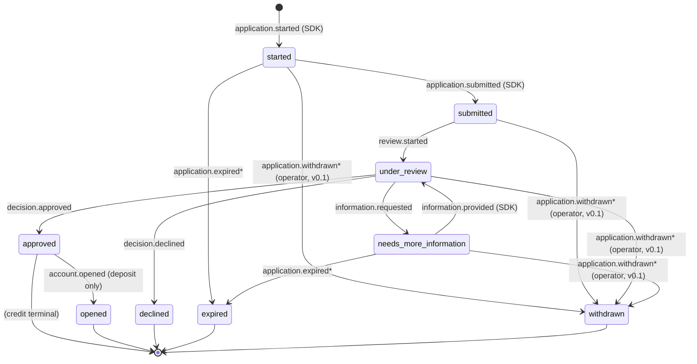
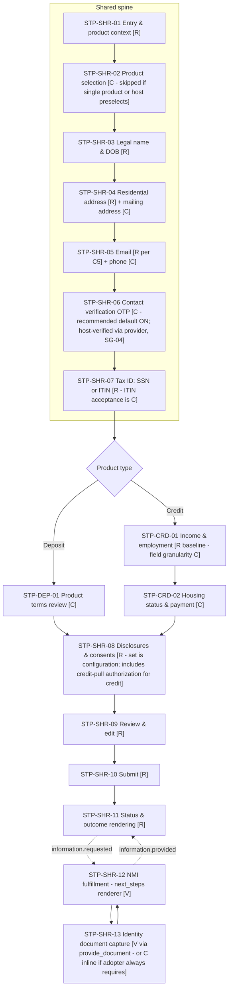

# Onboarding SDK Requirements — Flow Architecture and the State Model

**Document:** SDK-REQ-02 | **Maps to:** Application Outcome & Status Standard (AOSS) v0.1.0 (Draft for Comment), SPEC.md + openapi.yaml as published at kameroli/aoss-middle-layer | **Status:** Draft | **Date:** September 1, 2026 | **Rev:** 3 (Rev 2: contact verification re-scoped institution-side; SG-04 added. Rev 3: reconciled to openapi.yaml v0.1.0 — §0.1 contract verification and §0.2 Standard feedback register added; `started` re-scoped client-local; withdraw and pre-submission resumability revised)

The SDK is specified as a client of any AOSS Level 2–conformant backend: the reference middle layer, or an adopting institution's own implementation of the published contract (`openapi.yaml`). The contract is the entire coupling surface. The two components are coordinated through the open standard and can be adopted together or independently. The SDK itself commits to taxonomy conformance on every surface it renders or emits: canonical statuses and error categories only; vendor vocabulary never appears in the SDK.

---

## 0. Design resolutions

Decisions taken against the published Standard before the flow model below was fixed. Each is already reflected in the sections that follow; the log is retained for traceability.

| ID   | Resolution                                                                                                                                                                                                                                                                                                                                                                                                                                                                                                                                                                                                                                                                                                                                    | Source                                |
| ---- | --------------------------------------------------------------------------------------------------------------------------------------------------------------------------------------------------------------------------------------------------------------------------------------------------------------------------------------------------------------------------------------------------------------------------------------------------------------------------------------------------------------------------------------------------------------------------------------------------------------------------------------------------------------------------------------------------------------------------------------------- | ------------------------------------- |
| R-01 | Abandonment is modeled by the proposed extension statuses `expired` (passive, set by the middle layer via an explicit logged sweep event — never computed by the client) and `withdrawn` (active cancellation by the applicant or an authorized operator). The SDK **renders** both and never sets `expired`; applicant-initiated withdrawal awaits an API operation (C2/F-02).                                                                                                                                                                                                                                                                                                                                                               | AOSS §3.3, transitions 9–14           |
| R-02 | Counteroffer is not modeled in AOSS v0.1 and is excluded from this state machine. Recommendation to the Standard: add `counteroffer` as a non-terminal extension status in a future MINOR version (`under_review → counteroffer → approved \| declined \| expired`), because (a) `approved` is terminal for credit and terminal-means-terminal (AOSS §3.1.4), and (b) a counteroffer requires applicant acceptance and can resolve adversely. Representing counteroffers through `needs_more_information` with an accept-terms next step is mechanically possible but **not recommended**: it conflates offer acceptance with information gathering and hides counteroffers from metrics. SDK rendering of counteroffers is deferred to v1.0. | Author decision + AOSS §3.1, §8       |
| R-03 | The deposit terminal success status is `opened`. `approved` is terminal for credit; for deposit it permits exactly one further transition, `approved → opened`. The two flows therefore have different terminal sets — see §1.                                                                                                                                                                                                                                                                                                                                                                                                                                                                                                                | AOSS §3.2                             |
| R-04 | Three distinct expiry/session clocks govern the flow — intake draft window, NMI response window, session TTL — with semantics and recommended ship defaults in §9.                                                                                                                                                                                                                                                                                                                                                                                                                                                                                                                                                                            | Author decision (adopter-overridable) |
| R-05 | AOSS Level 2 defines a status-change callback (webhook) — a server-to-server mechanism the mobile SDK cannot receive. v0.1 SDK status refresh is **polling with adaptive backoff** (§7); v1.0 adds host-app push relay (institution server receives the webhook, sends a push, host wakes the SDK's refresh).                                                                                                                                                                                                                                                                                                                                                                                                                                 | AOSS §9 Level 2 + author decision     |
| R-06 | The `under_review ⇄ needs_more_information` cycle may repeat; the bound is adopter policy enforced by the middle layer (AOSS: implementations SHOULD bound iterations and surface the count in metrics). The SDK imposes no bound and MUST render any number of cycles without state corruption; `expired` may follow `needs_more_information` when the response window lapses. Covered in the test plan.                                                                                                                                                                                                                                                                                                                                     | AOSS §3.4 + author decision           |
| R-07 | SPEC.md does not define intake field requirements — AOSS standardizes statuses, outcomes, and errors, not application content. Intake field minimums are asserted at screen-specification level against the `openapi.yaml` `Applicant` schema and a CIP-style baseline (legal name, DOB, residential address, identification number), flagged for review against each adopting institution's CIP program. Not a legal conclusion.                                                                                                                                                                                                                                                                                                             | AOSS §1.2 + openapi.yaml              |

---

## 0.1 API contract verification (openapi.yaml v0.1.0)

Verified operations. These are the only middle-layer surfaces the SDK uses; anything the sequence diagrams or downstream specifications reference must map to this table.

| Operation                | Method & path                                              | SDK use                                                                                                                                                                                                                                                                              |
| ------------------------ | ---------------------------------------------------------- | ------------------------------------------------------------------------------------------------------------------------------------------------------------------------------------------------------------------------------------------------------------------------------------ |
| `submitApplication`      | `POST /applications`                                       | Submits the **completed** application. `Idempotency-Key` required. `201` returns `Application {application_id, status=submitted, outcome}`; `200` on idempotent replay; `400` validation (with `field_errors[]` JSON pointers), `409` duplicate_submission, `503` vendor_unavailable |
| `getApplication`         | `GET /applications/{applicationId}`                        | Status + Outcome retrieval — the polling target (§7)                                                                                                                                                                                                                                 |
| `provideInformation`     | `POST /applications/{applicationId}/information`           | NMI fulfillment: `items[]`, each `{next_step_id, values \| document{content_type, content_base64} \| consent}`. `Idempotency-Key` required. `409` when the status doesn't accept information                                                                                         |
| `listNextSteps`          | `GET /applications/{applicationId}/next-steps`             | Lightweight checklist refresh independent of the full outcome                                                                                                                                                                                                                        |
| `listStatusEvents`       | `GET /applications/{applicationId}/events?after_sequence=` | Audit history; optional SDK use for reconciliation                                                                                                                                                                                                                                   |
| `statusChanged` callback | webhook to adopter `callback_url`                          | Server-to-server only; confirms R-05 (mobile cannot receive it — polling stands)                                                                                                                                                                                                     |

**Material consequences:**

- **C1 — `started` is client-local in v0.1.** There is no create or draft operation; the middle layer first learns of an application at `submitApplication`, which records it and transitions it to `submitted` in one call. SPEC.md transition 1 is therefore a client-side event in this API version; the SDK generates a `client_application_ref` for the intake session and carries it in the submission. `application_id` is first known from the `201` response.
- **C2 — No applicant-initiated withdraw operation.** `withdrawn` and `application.withdrawn` exist in the schemas, but no endpoint lets the applicant trigger them. Transitions 11–14 are unreachable by the applicant through this API. Consequences in §8 and F-02.
- **C3 — No draft persistence.** With no server-held draft, pre-submission resumability is redesigned: in-memory state during the session, an optional host-implemented `DraftStore` for cross-process persistence. Server-side `started → expired` (transition 9) is likewise unreachable — no `started` record exists to expire — so intake expiry is client/host-side in v0.1 (§9, F-01).
- **C4 — Document upload is inline base64** inside `provideInformation` (no separate upload endpoint, no multipart). Capture screens must downscale/compress client-side and respect payload-size limits; memory behavior is specified at screen level.
- **C5 — Applicant required minimum (per schema):** `first_name`, `last_name`, `date_of_birth`, `address{line1, city, state, zip_code}`, `email`, `government_id{ssn|itin}`; `phone` optional. Note: **email is required** — phone cannot substitute for it. Income/housing and mailing address are adopter extensions to `Applicant` (the schema is explicitly extensible); the SDK's extension-field conventions are defined in the screen-level field specifications.
- **C6 — Consents travel at submission**: `consents[]` required (`minItems: 1`), each `{disclosure_id, disclosure_version, accepted_at}`. The schema carries no language or presentment-method fields (F-03). The SG-04 contact-verification attestation travels in `metadata` (namespaced, PII-free string entries) — see AS-02.

## 0.2 Standard feedback register

Findings this requirements pass surfaced about the Standard itself. The author is the Standard's maintainer; these are v0.2 backlog candidates, appropriately filed as repository issues so the paper trail is public.

| ID   | Finding                                                                                                                                                                                              | Suggested direction                                                                                                                                                                        |
| ---- | ---------------------------------------------------------------------------------------------------------------------------------------------------------------------------------------------------- | ------------------------------------------------------------------------------------------------------------------------------------------------------------------------------------------ |
| F-01 | SPEC.md models `started` server-side (transitions 1, 9, 11) but the API provides no operation to register a started application — those transitions are unreachable through the published contract   | Either add an intake-registration/draft operation, or scope SPEC.md to state that `started` is client-local in v0.1                                                                        |
| F-02 | No applicant-initiated withdraw operation, though `withdrawn` and `application.withdrawn` are defined                                                                                                | Add e.g. `POST /applications/{applicationId}/withdrawal` (idempotent)                                                                                                                      |
| F-03 | `ConsentRecord` lacks language and presentment-evidence fields                                                                                                                                       | Add `language`, and consider `method`/document-hash fields, so adopters' consent records can carry controlling-language and presentment evidence                                           |
| F-04 | No draft persistence operations; intake resumability is left entirely to clients                                                                                                                     | Add draft operations, or state the delegation explicitly in SPEC.md                                                                                                                        |
| F-05 | No counteroffer modeling (R-02)                                                                                                                                                                      | Add `counteroffer` as a non-terminal extension status in a MINOR revision                                                                                                                  |
| F-06 | Contact-verification attestation has no first-class home; the `metadata` convention works but is uncontrolled                                                                                        | Consider a typed attestation field on `ApplicationSubmission`                                                                                                                              |
| F-07 | `openapi.yaml` defines no `securitySchemes`, yet `getApplication`'s 404 ("No application with this identifier is visible to the caller") implies caller-scoped authorization that is never specified | Either define a security scheme, or explicitly delegate transport authentication to adopter infrastructure (gateway/IdP) and specify the caller-visibility semantics adopters must enforce |

---

## 1. The state model as adopted by the SDK

The SDK adopts the AOSS v0.1 core statuses and both proposed extension statuses. For each status: whether the SDK can initiate the transition into it, or only render it.

| Status                   | Terminal                                     | Applies to   | SDK role                                                                                                                                                                                                          |
| ------------------------ | -------------------------------------------- | ------------ | ----------------------------------------------------------------------------------------------------------------------------------------------------------------------------------------------------------------- |
| `started`                | No                                           | Both         | **Client-local phase (C1)** — intake in progress; the middle layer has no record until submission. The SDK generates `client_application_ref` and emits `sdk.application.started` analytics; no middle-layer call |
| `submitted`              | No                                           | Both         | **Initiates** — submit action fires `application.submitted` (with `Idempotency-Key`)                                                                                                                              |
| `under_review`           | No                                           | Both         | **Renders** — entered server-side via `review.started`; also re-entered after `information.provided`                                                                                                              |
| `needs_more_information` | No                                           | Both         | **Renders** the request; **initiates the exit** — fulfilling next steps fires `information.provided`                                                                                                              |
| `approved`               | Credit: yes. Deposit: admits only `→ opened` | Both         | **Renders**                                                                                                                                                                                                       |
| `opened`                 | Yes                                          | Deposit only | **Renders**                                                                                                                                                                                                       |
| `declined`               | Yes                                          | Both         | **Renders** — with `reasons[]` and next-step guidance                                                                                                                                                             |
| `expired` \*             | Yes                                          | Both         | **Renders only** — set exclusively by the middle layer's logged sweep; the SDK never computes expiry                                                                                                              |
| `withdrawn` \*           | Yes                                          | Both         | **Renders** (operator-set in v0.1). No applicant-initiated withdraw operation exists in the API (C2/F-02); pre-submission cancel is a client-local discard producing no status (§8)                               |

\* AOSS §3.3 proposed extensions; adopters MAY implement. SDK requirement SM-01: the SDK MUST render `expired` and `withdrawn` correctly whether or not the adopter's middle layer emits them (rendering support is unconditional; emission is adopter-dependent).

**Terminal sets differ by product** (SM-02): deposit terminals are {`opened`, `declined`, `expired`, `withdrawn`}; credit terminals are {`approved`, `declined`, `expired`, `withdrawn`}. For deposit, `approved` is a transitory provisioning state the SDK renders as an interstitial, not a success screen (§4).

### 1.1 Permitted transitions and SDK involvement

Numbering follows AOSS §3.4.

| #       | From → To                                                                   | Event                   | Initiated by                    | SDK behavior                                                                                                                                                                                                                                  |
| ------- | --------------------------------------------------------------------------- | ----------------------- | ------------------------------- | --------------------------------------------------------------------------------------------------------------------------------------------------------------------------------------------------------------------------------------------- |
| 1       | _(none)_ → `started`                                                        | `application.started`   | SDK (client-local, C1)          | No middle-layer call; SDK generates `client_application_ref` and begins intake                                                                                                                                                                |
| 2       | `started` → `submitted`                                                     | `application.submitted` | SDK (`submitApplication`)       | `POST /applications` with `Idempotency-Key` records the application **and** transitions it to `submitted` in one call; `application_id` first known from the `201`; on `timeout`, reconcile via idempotent replay — never blind-resubmit (§4) |
| 3       | `submitted` → `under_review`                                                | `review.started`        | Middle layer                    | Render processing state; begin polling (§7). Per AOSS, even sub-second automated decisions pass through `under_review`; the SDK MUST tolerate receiving 3→6 or 3→7 in immediate succession within one poll                                    |
| 4       | `under_review` → `needs_more_information`                                   | `information.requested` | Middle layer / decision system  | Render next-step checklist from `next_steps[]` (§5.1)                                                                                                                                                                                         |
| 5       | `needs_more_information` → `under_review`                                   | `information.provided`  | SDK (fulfillment)               | Submit requested inputs per `next_steps[].input_schema`; resume polling                                                                                                                                                                       |
| 6       | `under_review` → `approved`                                                 | `decision.approved`     | Middle layer                    | Credit: terminal success render + host callback. Deposit: provisioning interstitial; continue polling for `opened`                                                                                                                            |
| 7       | `under_review` → `declined`                                                 | `decision.declined`     | Middle layer                    | Terminal adverse render from `reasons[]` + `next_steps[]`; host callback                                                                                                                                                                      |
| 8       | `approved` → `opened`                                                       | `account.opened`        | Middle layer (deposit only)     | Terminal success render + host callback                                                                                                                                                                                                       |
| 9\*     | `started` → `expired`                                                       | `application.expired`   | Middle layer sweep              | **Unreachable in v0.1** (C3/F-01): no `started` record exists server-side; intake expiry is client/host-side per §9. Retained for forward compatibility                                                                                       |
| 10\*    | `needs_more_information` → `expired`                                        | `application.expired`   | Middle layer sweep              | Same; render against any `due_by` previously shown                                                                                                                                                                                            |
| 11*–14* | `started`/`submitted`/`under_review`/`needs_more_information` → `withdrawn` | `application.withdrawn` | Operator only in v0.1 (C2/F-02) | The API defines no applicant withdraw operation. The SDK renders `withdrawn` when reported; pre-submission cancel is a client-local discard (§8). In-app post-submission cancel returns in v1.0 if F-02 lands                                 |

### 1.2 Illegal transitions and defensive rendering

- SM-03: The SDK MUST NOT attempt any transition not listed above. In particular it never calls submit from any status other than `started`, never fulfills next steps outside `needs_more_information`, and never offers cancel from a terminal status.
- SM-04: `declined`, `opened`, `expired`, `withdrawn` admit no outgoing transitions; `approved` admits only #8 and only for deposit. On any terminal status, the SDK renders the terminal outcome idempotently on every resume.
- SM-05 (forward compatibility, per AOSS §8): the SDK MUST tolerate unknown optional fields, unknown `sub_status` values, and unknown `next_steps[].type` values (safe fallback: render title/description with a contact-support affordance). An **unknown status** is a breaking condition the Standard does not license; the SDK MUST NOT crash — it renders a generic "application in progress — check back" fallback, emits a diagnostic event, and surfaces an integration error to the host in debug builds.
- SM-06: `sub_status` is advisory and MUST NOT be required for correct rendering (AOSS §3.6). v0.1 decision: `sub_status` is never shown to applicants; it is passed through in analytics payloads only.
- SM-07: If the middle layer reports a transition the SDK's local model considers impossible from its last-known status (e.g., last saw `started`, now sees `declined`), the server is authoritative: the SDK re-syncs to the server status, renders it, and emits a diagnostic event. The SDK never "corrects" the server.

### 1.3 State diagram



\* AOSS v0.1 proposed extension transitions.

---

## 2. Status → experience mapping

"Events" are SDK analytics events; final names in the event catalog (to follow with the screen specifications) will be namespaced `sdk.*` to avoid collision with AOSS `StatusEvent` names. "Resumable" = what a resume into this status restores.

| Status                   | What the applicant sees                                                                                                                                                                                                                                       | What the SDK does                                                                                                                                                                                                  | Events                                                                    | Resumable                                                                    |
| ------------------------ | ------------------------------------------------------------------------------------------------------------------------------------------------------------------------------------------------------------------------------------------------------------- | ------------------------------------------------------------------------------------------------------------------------------------------------------------------------------------------------------------------ | ------------------------------------------------------------------------- | ---------------------------------------------------------------------------- |
| `started`                | The intake steps themselves (§5), with progress indication                                                                                                                                                                                                    | Drives the step graph; holds in-memory form state, saving to the host `DraftStore` when configured (ER-05, C3); persists `client_application_ref` + step pointer on device — identifiers only, never applicant PII | `sdk.application.started`, `sdk.step.viewed/completed/exited`             | Within a session, always; across process death only with a host `DraftStore` |
| `submitted`              | Submission confirmation transitioning into processing                                                                                                                                                                                                         | Records submission acknowledgment; begins polling                                                                                                                                                                  | `sdk.application.submitted`, `sdk.status.rendered`                        | Yes — resume lands on the processing/status screen                           |
| `under_review`           | Processing screen; after a configurable threshold (§9, default 30 s) the copy shifts to "taking longer than expected — we'll hold your place" per AOSS `vendor_unavailable` guidance; no vendor identity, ever                                                | Polls with backoff (§7); renders `explanation.text` if provided; never invents copy                                                                                                                                | `sdk.status.rendered`, `sdk.status.revisited`                             | Yes — status refresh on entry                                                |
| `needs_more_information` | A checklist built from `next_steps[]`: title, description, `due_by` when present, one renderer per step `type` (§5.1)                                                                                                                                         | Renders typed next-step UIs; collects and submits inputs per `input_schema`; fires `information.provided` on completion                                                                                            | `sdk.nmi.request_viewed`, `sdk.nmi.item_completed`, `sdk.nmi.resubmitted` | Yes — checklist re-renders with per-item completion state from the server    |
| `approved` (credit)      | Terminal approval screen: `explanation.text`, institution-configured next actions; card activation/servicing is host-app territory                                                                                                                            | Terminal render; host success callback with identifiers                                                                                                                                                            | `sdk.status.rendered`, `sdk.flow.completed`                               | Terminal render, idempotent                                                  |
| `approved` (deposit)     | Provisioning interstitial: "approved — finishing account setup"                                                                                                                                                                                               | Continues polling for `opened`; does NOT fire success callback yet                                                                                                                                                 | `sdk.status.rendered`                                                     | Yes — re-polls                                                               |
| `opened` (deposit)       | Terminal success: account identifiers as supplied by the outcome, configured next actions (e.g., funding — v1.0)                                                                                                                                              | Terminal render; host success callback                                                                                                                                                                             | `sdk.status.rendered`, `sdk.flow.completed`                               | Terminal render, idempotent                                                  |
| `declined`               | Terminal adverse screen: ranked `reasons[].description` verbatim from the adopter's reason catalog; `next_steps[]` (e.g., contact_support); pointer to the institution's formal adverse-action notice, which the institution delivers through its own channel | Renders reasons exactly as supplied — never generates, softens, or reorders them (rank order is the order); host callback                                                                                          | `sdk.status.rendered`, `sdk.status.help_tapped`, `sdk.flow.completed`     | Terminal render, idempotent                                                  |
| `expired`                | "This application has expired" + start-a-new-application affordance (new lifecycle; MAY reference the prior application)                                                                                                                                      | Terminal render; clears resume token; host callback                                                                                                                                                                | `sdk.status.rendered`, `sdk.flow.completed`                               | Terminal render; resume token invalidated                                    |
| `withdrawn`              | Cancellation/withdrawal confirmation                                                                                                                                                                                                                          | Terminal render when the middle layer reports it (operator-initiated in v0.1 — C2); clears local state; host callback                                                                                              | `sdk.status.rendered`, `sdk.flow.completed`                               | Terminal render                                                              |
| _(error condition)_      | Per-category behavior (§3) — never rendered as a status                                                                                                                                                                                                       | Category-driven retry/guidance; application status unchanged (AOSS §4.3: retry exhaustion never produces a terminal status)                                                                                        | `sdk.error.shown`, `sdk.error.retried`                                    | Yes — errors are conditions on a status, not states                          |

Cross-cutting accessibility requirement SM-08: every status change rendered while a screen is visible MUST be announced to assistive technology (VoiceOver/TalkBack announcement), not communicated visually alone. Per-screen detail follows in the screen specifications and non-functional requirements.

---

## 3. Error taxonomy

### 3.1 Reconciliation with the Standard

The provisional category list used during early drafting (connectivity, vendor timeout, vendor unavailable, session expired, rate limited, ineligible, hard stop, unknown) is superseded by the AOSS §4.2 canonical categories plus a small set of **client-local conditions** that arise on the device and can never come from the middle layer. Mapping, so no parallel taxonomy is invented:

| Working term       | Resolution                                                                                                                                      |
| ------------------ | ----------------------------------------------------------------------------------------------------------------------------------------------- |
| connectivity       | Client-local `device_offline`                                                                                                                   |
| vendor timeout     | AOSS `timeout`                                                                                                                                  |
| vendor unavailable | AOSS `vendor_unavailable`                                                                                                                       |
| session expired    | Client-local `session_expired` (auth concern; not an application status or AOSS category)                                                       |
| rate limited       | Client-local transport condition `transport_throttled` (HTTP 429 from the middle layer; retry with backoff per `Retry-After` when present)      |
| ineligible         | Not a category: an intake-rule failure surfaces as AOSS `validation_error`; a policy determination surfaces as `policy_decline` with `declined` |
| hard stop          | AOSS `policy_decline` accompanying `declined`                                                                                                   |
| unknown            | Client-local `unrecognized_error` (forward-compat fallback per SM-05)                                                                           |

### 3.2 AOSS canonical categories — SDK behavior

Semantics and retryability are the Standard's (AOSS §4.2); this table adds the SDK's rendering and retry affordances. Universal rules: the SDK never shows `message` (operator-facing) to applicants; renders `user_guidance` when supplied, otherwise its own localized category-default copy; logs `correlation_id` with every error event; and never conflates errors with declines (AOSS §4.1).

| Category                        | Retryable                         | SDK behavior                                                                                                                                                                                                | Guidance pattern                                                                                                                                                            |
| ------------------------------- | --------------------------------- | ----------------------------------------------------------------------------------------------------------------------------------------------------------------------------------------------------------- | --------------------------------------------------------------------------------------------------------------------------------------------------------------------------- |
| `validation_error`              | After correction                  | Field-level inline error at the offending input, focus moved to it (accessibility: announced); submit blocked until corrected. No automatic retry — pointless without change, per the Standard              | Specific and field-level: exactly what to fix. Never "something went wrong"                                                                                                 |
| `identity_verification_failure` | Sometimes (with corrected input)  | Render as review-and-confirm of previously entered details, or as the NMI checklist if the middle layer routed it there — adopter policy decides the routing (AOSS), the SDK renders either                 | Neutral, non-forensic: "We couldn't verify some of your information. Please review and confirm the details below." Never disclose which check failed or how detection works |
| `document_quality`              | Yes — retake                      | Immediate in-flow retake with concrete capture guidance; preserve the rest of the step's state. The Standard notes this category rewards specific messaging — the capture screen specification invests here | "All four corners visible," "avoid glare," "use a dark background" — concrete, per the guidance codes supplied                                                              |
| `vendor_unavailable`            | Middle-layer retries with backoff | Applicant is never asked to solve it: short waits render as processing; past the threshold (§9), "taking longer than expected" with hold-your-place messaging; status unchanged                             | No vendor identity, no outage detail, ever                                                                                                                                  |
| `timeout`                       | Idempotent retry only             | Outcome unknown — the SDK MUST NOT prompt resubmission (duplicate-application risk per the Standard). Render as processing; reconcile via idempotent replay (§4)                                            | Same as `vendor_unavailable`                                                                                                                                                |
| `policy_decline`                | No                                | Not an error render: accompanies `declined` and flows through the outcome path (§2). SDK MUST NOT render it through error UI                                                                                | AOSS §5/§7 structures; reasons verbatim                                                                                                                                     |
| `duplicate_submission`          | No                                | Invisible where possible: render the original result returned by the middle layer                                                                                                                           | None — show the original result                                                                                                                                             |
| `consent_required`              | After consent                     | Present the referenced disclosure and capture consent in-flow with presentment/consent evidence (S-10/S-11); then resume the interrupted action                                                             | The specific disclosure, in-flow, recorded                                                                                                                                  |
| `internal_error`                | Yes, with backoff                 | Generic applicant-safe message + retry control; escalating copy on repetition; correlation ID available behind a "reference code" affordance for support calls (ID only — no PII)                           | Generic; detail lives in operator logs keyed by correlation ID                                                                                                              |

### 3.3 Client-local conditions

| Condition                 | Detection                                                                      | SDK behavior                                                                                                                                                                                                                | Recovery                                                                                                     |
| ------------------------- | ------------------------------------------------------------------------------ | --------------------------------------------------------------------------------------------------------------------------------------------------------------------------------------------------------------------------- | ------------------------------------------------------------------------------------------------------------ |
| `device_offline`          | Reachability / request failure without response                                | Non-destructive banner or blocking state depending on the action attempted; intake input is never lost (in-memory form state, plus `DraftStore` when configured); submission is never queued offline (out of scope in v0.1) | Automatic on reconnect; manual retry control on blocking renders                                             |
| `session_expired`         | 401 from the middle layer (or the gateway fronting it) or host-declared expiry | Pause the flow, clear sensitive in-memory fields, request a fresh session from the host via callback; on success, resume in place; on failure, exit with a resumable state                                                  | Host re-authentication against the institution's auth infrastructure; stored identifiers remain valid per §9 |
| `transport_throttled`     | HTTP 429                                                                       | Silent backoff honoring `Retry-After`; degrade polling cadence; only surface to the applicant if a user-initiated action cannot complete within its own timeout                                                             | Automatic                                                                                                    |
| `sdk_configuration_error` | Config validation at initialization                                            | Fail fast **before** any applicant-facing screen: refuse to launch, return a developer-facing error to the host. Never render a broken flow to an applicant                                                                 | Developer fixes configuration                                                                                |
| `unrecognized_error`      | Unknown category/code (SM-05)                                                  | Render as `internal_error` fallback; emit diagnostic event with the raw category string (PII-free)                                                                                                                          | Retry with backoff                                                                                           |

---

## 4. Client-side retry, idempotency, and correlation rules

- ER-01: Every SDK request carries `X-Correlation-Id` (SDK-generated UUID per logical operation, echoed and propagated per AOSS §6.1; never PII-encoding). The SDK retains the correlation ID of the last failed operation for support-reference display.
- ER-02: Every mutating operation (`submitApplication`, `provideInformation`) carries an `Idempotency-Key`. Retries reuse the same key and payload. The SDK MUST NOT reuse a key with a changed payload (the middle layer will — correctly — reject it as `duplicate_submission`).
- ER-03: After a `timeout` on a mutating call, the SDK retries idempotently (same key) or queries current state; it never issues a fresh non-idempotent request, and never asks the applicant to re-enter and resubmit.
- ER-04: Client retry policy: exponential backoff with jitter, bounded budget per operation; on exhaustion, the application's status is unchanged (AOSS §4.3) and the SDK renders the appropriate error condition, preserving all applicant input.
- ER-05 (Rev 3): There are no middle-layer draft operations (C3). In-memory form state is authoritative during a session. Pre-submission persistence across process death is provided, when configured, by a host-implemented `DraftStore` interface (`save`/`load`/`clear` keyed on `client_application_ref`). The SDK itself stores no applicant PII at rest; absent a `DraftStore`, intake state survives backgrounding within the process lifetime only, and adopter documentation states so plainly.

---

## 5. Step graph — both flows, shared spine

Legend: **[R]** required core (cannot be disabled — the required intake minimums live here) · **[C]** configurable (adopter on/off or reorder within rules) · **[D]** conditional on data or configuration · **[V]** vendor-class-triggered (exists because a class of decision system requires it; reached via the outcome/next-step machinery, not hardcoded sequence).



Notes:

- SG-01: Steps within the spine MAY be reordered by configuration only where no dependency exists (e.g., tax ID before or after contact verification); dependencies (product context before product-specific fields; all intake before disclosures; disclosures before review; review before submit) are fixed.
- SG-02 (deferred steps): account funding, overdraft opt-in / beneficiary / paperless enrollment, and counteroffer acceptance attach to this graph in v1.0 without altering the spine.
- SG-03: `identity_verification_failure` routing (§3.2) re-enters the graph either at a review-and-confirm rendering of STP-SHR-03/04/07 or at STP-SHR-12, per the middle layer's outcome — the SDK does not choose.
- SG-04: **OTP contact verification is an institution responsibility; the middle layer plays no role in code issuance or checking.** Two designs were considered:
  - **(a) SDK-rendered screens backed by a host-implemented `ContactVerificationProvider`** — an in-process interface the host supplies (`sendCode(channel, destination)`, `verifyCode(code) → result`), behind which the institution wires its own OTP service.
  - **(b) Full host handoff** — the SDK yields at this step, the host runs its own verification UI, and returns a result.
  - **Adopted: (a).** It preserves visual and accessibility consistency across the flow, keeps step-level drop-off instrumentation intact, keeps resume semantics inside the SDK, and keeps the SDK free of any SMS/email delivery assumption (vendor-agnostic by construction — the SDK never learns which delivery service exists). Design (b) remains available as configuration for institutions with a mandated native verification module: the step is marked host-handled, the host returns a verification attestation, and the SDK records it and moves on.
  - Provider result contract (interface defined in the public API specification): `success`, `invalid_code`, `expired_code`, `delivery_failure`, `locked_out`. Rendering: `invalid_code`/`expired_code` as field-level inline errors with a resend affordance; `delivery_failure` with channel-switch and retry; `locked_out` blocks the step with contact-support guidance and no further attempts.
  - Evidence and data handling: the SDK records a verification attestation (channel, timestamp, provider result reference) into `ApplicationSubmission.metadata` as namespaced, PII-free string entries (e.g., `contact_verification.channel`, `contact_verification.verified_at`, `contact_verification.ref`) so the application record reflects that contact was verified (C6; first-class field proposed as F-06). One-time codes are never transmitted to the middle layer, never persisted by the SDK, and never appear in any analytics or audit event. Enabling the step without a provider is an `sdk_configuration_error` at initialization (fail fast, §3.3).

### 5.1 The NMI fulfillment step is a typed-renderer engine

STP-SHR-12 is not a fixed screen: it is a renderer that composes a checklist from `next_steps[]`, with one renderer per AOSS next-step `type`:

| `next_steps[].type`      | Renderer                                                                               | Notes                                                                                      |
| ------------------------ | -------------------------------------------------------------------------------------- | ------------------------------------------------------------------------------------------ |
| `provide_document`       | Document capture/upload (STP-SHR-13) honoring `input_schema`                           | Generic capture with basic client-side quality checks in v0.1; vendor capture SDKs in v1.0 |
| `confirm_detail`         | Field review-and-confirm form generated from `input_schema`                            | Also serves `identity_verification_failure` routing                                        |
| `acknowledge_disclosure` | Disclosure presentment + consent capture (same mechanism as STP-SHR-08, same evidence) | Serves `consent_required` recovery too                                                     |
| `wait`                   | Informational row with any `due_by`; no action                                         |                                                                                            |
| `contact_support`        | Institution-configured contact affordances                                             |                                                                                            |
| _(unknown type)_         | Safe fallback: title + description + contact affordance (SM-05)                        | Forward compatibility is mandatory, not best-effort                                        |

This is the architectural core of the SDK's Standard alignment: any information request an adopter's decision systems can express in AOSS next steps renders correctly with zero SDK changes.

---

## 6. Sequence diagrams

### 6.1 Happy path (deposit)

```mermaid
sequenceDiagram
    participant H as Host app
    participant S as SDK
    participant M as Middle layer (AOSS)
    participant A as Adapter / decision systems

    H->>S: launch(deposit, config, session token — institution-issued)
    S->>S: validate config (fail fast on sdk_configuration_error)
    Note over S: started — client-local (C1): client_application_ref generated;<br/>intake runs on in-memory state (+ DraftStore if configured, ER-05)
    S->>H: sendCode / verifyCode (ContactVerificationProvider, SG-04)
    H-->>S: verified — attestation → ApplicationSubmission.metadata
    S->>M: POST /applications [X-Correlation-Id, Idempotency-Key]<br/>product_type, applicant, consents[], client_application_ref, metadata
    M-->>S: 201 Application (application_id, status=submitted)
    M->>A: dispatch → review.started
    Note over M: status=under_review
    S->>M: GET /applications/(applicationId) — poll, §7
    M-->>S: under_review
    A-->>M: favorable results → decision.approved
    Note over M: approved → provisioning → account.opened
    S->>M: GET /applications/(applicationId)
    M-->>S: opened (outcome: explanation, identifiers)
    S->>S: render terminal success
    S->>H: success callback (application_id)
```

### 6.2 needs_more_information → resume → resolution

```mermaid
sequenceDiagram
    participant H as Host app
    participant S as SDK
    participant M as Middle layer (AOSS)
    participant A as Adapter / decision systems

    A-->>M: document verification requires input → information.requested
    Note over M: status=needs_more_information<br/>next_steps=[provide_document(id, due_by, input_schema)]
    S->>M: GET /applications/(applicationId) — poll
    M-->>S: needs_more_information + next_steps
    S->>S: render checklist (typed renderers §5.1), show due_by
    Note over S,H: Applicant leaves; process dies.<br/>Days later: host resumes with stored application_id
    H->>S: resume(application_id)
    S->>M: GET /applications/(applicationId)
    M-->>S: needs_more_information (unchanged) + next_steps
    S->>S: capture document — client quality checks, downscale/compress (C4)
    S->>M: POST /applications/(applicationId)/information [Idempotency-Key]<br/>items=[ next_step_id + document(content_type, content_base64) ]
    M-->>S: 200 — accepted → information.provided
    Note over M: status=under_review
    S->>M: GET /applications/(applicationId) — poll
    A-->>M: verification passes → decision.approved
    M-->>S: approved → (deposit) opened
    S->>H: success callback
```

Operation binding verified against `openapi.yaml` v0.1.0 (§0.1): `POST /applications` (submitApplication), `GET /applications/{applicationId}` (getApplication), `POST /applications/{applicationId}/information` (provideInformation), with `GET .../next-steps` and `GET .../events` available for checklist refresh and reconciliation.

---

## 7. Status refresh strategy (R-05 detail)

- PR-01 (v0.1): polling of `GET /applications/{applicationId}` (getApplication). Cadence: immediate fetch on entering a status screen; then 2 s, backing off ×1.5 per attempt to a 30 s ceiling while foregrounded on a processing screen; jitter on every interval; slow cadence (ceiling only) on non-processing status screens; halt on terminal status; always refresh on foreground and on resume. Honor `transport_throttled` by extending cadence. `GET .../events?after_sequence=` MAY be used on resume to reconcile missed transitions for analytics continuity; rendering decisions come from the current outcome, never from replaying events.
- PR-02: after 30 s (configurable threshold, §9) in `under_review` without change, shift to hold-your-place copy per §2; polling continues at ceiling cadence.
- PR-03 (v1.0): push relay — the institution's server consumes the AOSS status-change webhook, issues a push through its own channel, and the host app wakes the SDK's refresh; resume entry from a notification remains the host's responsibility. Polling remains the fallback.

## 8. Cancel / withdraw behavior (R-01 detail)

- CW-01 (Rev 3): **Pre-submission** (`started`, client-local): cancel is a confirm-and-discard of local intake state and any `DraftStore` entry. No middle-layer call — no server record exists yet — and no `withdrawn` status results; the application simply never existed server-side.
- CW-02 (Rev 3): **Post-submission cancel is not offered in SDK v0.1**: the API defines no applicant withdraw operation (C2/F-02). If the middle layer reports `withdrawn` (operator-initiated on the applicant's request through institution channels), the SDK renders it (SM-01). Post-submission status screens MAY carry a configured contact affordance ("need to cancel? contact us") using the `contact_support` pattern. When F-02 lands, v1.0 restores in-app post-submission cancel with per-phase configuration reflecting AOSS's "where adopter policy permits."
- CW-03: The SDK never renders "expired" of its own accord (R-01); if a resume finds `expired`, that is the server's determination, rendered as-is. In v0.1 this can only arise from the NMI response window (transition 10), since transition 9 is unreachable (C3).

## 9. Session, draft, and expiry clocks (R-04 detail)

| Clock                     | What it governs                                                                                                                                                                                                  | Where enforced                                       | Recommended default (adopter-overridable)                                                                             |
| ------------------------- | ---------------------------------------------------------------------------------------------------------------------------------------------------------------------------------------------------------------- | ---------------------------------------------------- | --------------------------------------------------------------------------------------------------------------------- |
| Intake draft window       | Client/host-side in v0.1 (C3): lifetime of local intake state and any host `DraftStore` entry; server-side `started → expired` is unreachable until F-01                                                         | SDK + host `DraftStore`                              | 30 days for `DraftStore` entries; in-memory otherwise                                                                 |
| NMI response window       | `needs_more_information` → `expired` (transition 10); outcome `due_by` when supplied is the rendered source of truth                                                                                             | Middle layer sweep                                   | 30 days; render `due_by` verbatim when present                                                                        |
| Session TTL               | Validity of the host-supplied session token (issued by the institution's auth infrastructure, not the middle layer); on expiry, `session_expired` handling (§3.3) — an auth concern, never an application status | Institution auth infrastructure (gateway/IdP) + host | 15 min inactivity; silent refresh via host where the host supports it                                                 |
| Hold-your-place threshold | When `under_review` copy shifts to "taking longer" (PR-02)                                                                                                                                                       | SDK                                                  | 30 s                                                                                                                  |
| Resume token validity     | Post-submission: the stored `application_id` (+ `client_application_ref`) — identifiers, not PII; server state is the source of truth. Pre-submission: the `DraftStore` reference                                | SDK (+ `DraftStore`)                                 | `application_id` retained until a terminal status has been rendered; `DraftStore` entries per the intake draft window |
